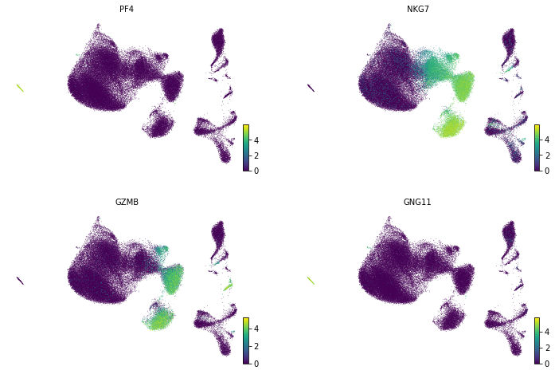

# In this notebook I will have a look into the single cells PBMC3K data set via scanpy


```python
# http://cf.10xgenomics.com/samples/cell-exp/1.1.0/pbmc3k/pbmc3k_filtered_gene_bc_matrices.tar.gz
```

## packages needed: 


```python
import scvelo as scv
import scanpy as sc
import numpy as np
import pandas as pd
import anndata
import os, sys, string

#from sc_utils import get_marker_gene_summary_table, cell_count_dotplot

#from scanpy.plotting._tools import plot_scatter
#sc.set_figure_params(vector_friendly=False, fontsize=18)

from scipy.io import mmwrite

from typing import Tuple, Union, List, Dict, Callable
import gzip
import shutil
import inspect

#import matplotlib.pyplot as plt
#%matplotlib inline
```


```python
print(sc.__version__)
print(anndata.__version__)
```

    1.4.4.post1
    0.6.22rc1


## load the data


```python
pathfrom = "gs://fc-3b7827a6-0f63-4b59-a4c6-07851ae38d84/projects/misc/public_data/pbmc3k.h5ad"
pathto = "/home/jupyter-user/data/public/PBMC/pbmc3k_2.h5ad"
filename =  "pbmc3k.h5ad"
```


```python
os.system("gsutil cp {0} {1}".format(pathfrom, pathto))
```


    0


```python
adata_3K = sc.read_h5ad(pathto)
```


```python
adata_3K
```


    AnnData object with n_obs × n_vars = 2638 × 1838 
        obs: 'n_genes', 'percent_mito', 'n_counts', 'louvain'
        var: 'n_cells'
        uns: 'louvain', 'neighbors', 'pca', 'rank_genes_groups'
        obsm: 'X_pca', 'X_tsne', 'X_umap'
        varm: 'PCs'


## look at the map


```python
scv.pl.scatter(adata=adata_3K, basis = "X_umap", color = "louvain")
```


### look at the quality parameters: 


```python
scv.pl.scatter(adata_3K, basis = "X_umap", color = ["percent_mito", "n_counts", "n_genes"], ncols = 2)
```


### look at cluster 0 in particular


```python
scv.pl.scatter(adata= adata_3K[adata_3K.obs["louvain"] == "0"], basis = "X_umap", color = "louvain")
```


```python
# count matrix missing - I read in another data set of this work and redo some steps before we get the map
```


```python
# load a data set with a higher cell number and compare this to the above
```


```python
# data is available here: 
# https://support.10xgenomics.com/single-cell-gene-expression/datasets/1.1.0/fresh_68k_pbmc_donor_a?
```


```python
adata_68K = sc.read_10x_mtx('/home/jupyter-user/data/public/PBMC/filtered_matrices_mex/hg19/',var_names='gene_symbols',cache=True)                                
```


```python
adata_68K
```


    AnnData object with n_obs × n_vars = 68579 × 32738 
        var: 'gene_ids'


```python
sc.pl.highest_expr_genes(adata_68K, n_top=25)
```


```python
# define the mt percentage in the data
mtgenes = adata_68K.var.index.str.startswith("MT-")
adata_68K.obs['percent_mito'] = np.sum( adata_68K[:, mtgenes].X, axis=1).A1 / np.sum(adata_68K.X, axis=1).A1

# add the total counts per cell as observations-annotation to adata
adata_68K.obs['n_counts'] = adata_68K.X.sum(axis=1).A1

adata_68K.raw = None

```


```python
# we next calculate the highly variable genes, however as we want to run scvi later, we dont use normalized count for that. Therefore, we introduce another adata where we calcualte the highly variable genes, and put them in our data set 68K cells later in, with which we run the scvi
```


```python
adata_68K_copy = adata_68K.copy()
```


```python
# remove mitochondrial genes
adata_68K_copy._inplace_subset_var(np.logical_not(mtgenes))
```


```python
# filter for lowly expressed genes 
# Min 20 cells - filters out 0 count genes
sc.pp.filter_genes(adata_68K_copy, min_cells=20)

# how many genes did we filter out?
print("We started with {0}".format(adata_68K.n_vars) + " genes")
print("and are at {0}".format(adata_68K_copy.n_vars) + " genes after filtering")
```

    We started with 32738 genes
    and are at 14077 genes after filtering


```python
# now normalize the data and log transform
sc.pp.normalize_per_cell(adata_68K_copy, counts_per_cell_after=1e4)
sc.pp.log1p(adata_68K_copy)

```


```python
adata_68K_copy.raw = adata_68K_copy

```


```python
# calculate the highly variable genes
sc.pp.highly_variable_genes(adata_68K_copy, min_mean=0.0125, max_mean=3, min_disp=0.5)


```


```python
# plot the highly variable genes:
sc.pl.highly_variable_genes(adata_68K_copy)

```


```python
# and have a look which genes are those:
sc.pl.highest_expr_genes(adata_68K_copy, n_top=20)
```


```python
# next write the highly variable genes into a list and add it to our initial adata_68K
```


```python
hvg_scanpy_list = list(adata_68K_copy.var[adata_68K_copy.var.highly_variable].index)
```


```python
hvg_scanpy_list.sort()
hvg=hvg_scanpy_list
#hvg
```


```python
# add the highly variable genes to our adata_68K
adata_68K.var['highly_variable'] = [g in hvg for g in adata_68K.var.index.astype(str)]
```


```python
# check if the length and genes are similar between our two data sets:
(adata_68K.var.index[adata_68K.var["highly_variable"] == True] == adata_68K_copy.var.index[adata_68K_copy.var["highly_variable"] == True] ).sum()
```


    1442


```python
# have a look at the UMAP on the transformed data 
```


```python
# compute the neighbors first - which is necessary to create the umap:
sc.pp.neighbors(adata_68K_copy, n_neighbors=10, n_pcs=40)
sc.pp.neighbors(adata_68K, n_neighbors=10, n_pcs=40)
```

    WARNING: You’re trying to run this on 14077 dimensions of `.X`, if you really want this, set `use_rep='X'`.
             Falling back to preprocessing with `sc.pp.pca` and default params.
    WARNING: You’re trying to run this on 32738 dimensions of `.X`, if you really want this, set `use_rep='X'`.
             Falling back to preprocessing with `sc.pp.pca` and default params.


```python
sc.tl.umap(adata_68K) # untransformed
```


```python
sc.pl.umap(adata_68K) # unfiltered, untransformed gene expression values 
```


```python
sc.tl.umap(adata_68K_copy)
```


```python
sc.pl.umap(adata_68K_copy) # transformed data 
```


```python
# run an initial clustering on the data - via louvain
```


```python
# now filter out the genes which are not highly variable:
```


```python
adata_68K_copy = adata_68K_copy[:, adata_68K_copy.var.highly_variable]
```


```python
sc.pp.neighbors(adata_68K_copy, n_neighbors=10, n_pcs=40) # recalculate the neighbors
```


```python
sc.tl.umap(adata_68K_copy) # make the umap
```


```python
sc.pl.umap(adata_68K_copy) # and plot it
```


```python
adata_68K_copy
```


    AnnData object with n_obs × n_vars = 68579 × 1442 
        obs: 'percent_mito', 'n_counts'
        var: 'gene_ids', 'n_cells', 'highly_variable', 'means', 'dispersions', 'dispersions_norm'
        uns: 'neighbors'
        obsm: 'X_pca', 'X_umap'


```python
adata_68K_copy
```


    AnnData object with n_obs × n_vars = 68579 × 1442 
        obs: 'percent_mito', 'n_counts'
        var: 'gene_ids', 'n_cells', 'highly_variable', 'means', 'dispersions', 'dispersions_norm'
        uns: 'neighbors'
        obsm: 'X_pca', 'X_umap'


```python
# now get some connections in the umap and see which cluster we can call in that umap: - I will try different louvain resolutions:
myres = [0.1, 0.2, 0.3, 0.4, 0.5]
for i in myres:
    sc.tl.louvain(adata_68K_copy, resolution = i, key_added="louvain"+str(i))
    sc.pl.scatter(adata_68K_copy, basis = "umap", color = "louvain"+str(i))
```


```python
adata_68K_copy
```


    AnnData object with n_obs × n_vars = 68579 × 1442 
        obs: 'percent_mito', 'n_counts', 'louvain0.1', 'louvain0.2', 'louvain0.3', 'louvain0.4', 'louvain0.5'
        var: 'gene_ids', 'n_cells', 'highly_variable', 'means', 'dispersions', 'dispersions_norm'
        uns: 'neighbors', 'louvain', 'louvain0.1_colors', 'louvain0.2_colors', 'louvain0.3_colors', 'louvain0.4_colors', 'louvain0.5_colors'
        obsm: 'X_pca', 'X_umap'


```python
res = 0.3
sc.tl.rank_genes_groups(adata_68K_copy,
                                    groupby='louvain' + str(res),
                                    key_added='rank_genes_groups' + str(res),
                                    method='wilcoxon',
                                    use_raw=False)
```


```python
 sc.tl.filter_rank_genes_groups(adata_68K_copy,
                                       groupby='louvain' + str(res),
                                       key='rank_genes_groups' + str(res),
                                       key_added='rank_genes_groups_filtered' + str(res),
                                       min_in_group_fraction=0.1,
                                       min_fold_change=1,
                                       max_out_group_fraction=0.5,
                                       use_raw=False)
```


```python
adata_68K_copy
```


    AnnData object with n_obs × n_vars = 68579 × 1442 
        obs: 'percent_mito', 'n_counts', 'louvain0.1', 'louvain0.2', 'louvain0.3', 'louvain0.4', 'louvain0.5', '__is_in_cluster__'
        var: 'gene_ids', 'n_cells', 'highly_variable', 'means', 'dispersions', 'dispersions_norm'
        uns: 'neighbors', 'louvain', 'louvain0.1_colors', 'louvain0.2_colors', 'louvain0.3_colors', 'louvain0.4_colors', 'louvain0.5_colors', 'rank_genes_groups0.3', 'rank_genes_groups_filtered0.3'
        obsm: 'X_pca', 'X_umap'


```python
# visualize results
sc.pl.rank_genes_groups(adata_68K_copy, key='rank_genes_groups_filtered' + str(res))
# visualize results using dotplot
sc.pl.rank_genes_groups_dotplot(adata_68K_copy, key='rank_genes_groups_filtered' + str(res), n_genes=4)
```


```python
scv.pl.scatter(adata = adata_68K_copy, basis = "umap", color = ["PF4", "NKG7", "GZMB", "GNG11"], ncols = 2)
```





```python
# now we will try another approach and go over the scvi approach (https://github.com/YosefLab/scVI)
# for that I will add a batch variable to our sample, as we only have one sample, it will be only one batch 
adata_68K.obs["batch"] = batch_list
adata_68K.obsm['batch'] = adata_68K.obs['batch'].astype(int).values
```


```python
adata_68K.obsm['batch']
```


```python
adata_68K.write("home/jupyter-user/data/public/PBMC/h5data/adata_68K_prescvi.h5ad")
```


```python
adata_68K
```


```python
datahome = "home/jupyter-user/data/public/PBMC/h5data/adata_68K_prescvi.h5ad"
pushto = "gs://fc-3b7827a6-0f63-4b59-a4c6-07851ae38d84/projects/misc/public_data/adata_68K_prescvi.h5ad"

os.system("gsutil cp " + datahome + " " + pushto)
```


```python
### still to come ### 
```
